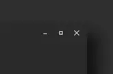
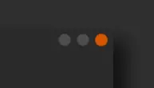

# Wayfire Styles

Place your favorite style on `/usr/share/firedecor/button-styles/`

## <a href="https://github.com/ItzSelenux/wayfire-firedecor-styles/tree/main/breeze"> Breeze

## <a href="https://github.com/ItzSelenux/wayfire-firedecor-styles/tree/main/graphite-dark"> Graphite Dark

## <a href="https://github.com/ItzSelenux/wayfire-firedecor-styles/tree/main/prof-gnome"> Prof Gnome

## <a href="https://github.com/ItzSelenux/wayfire-firedecor-styles/tree/main/sweet"> Sweet

